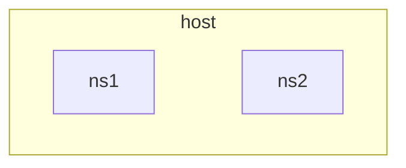
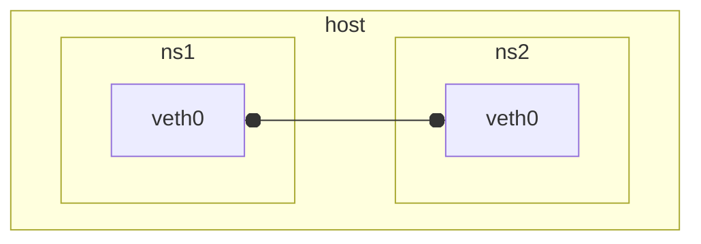
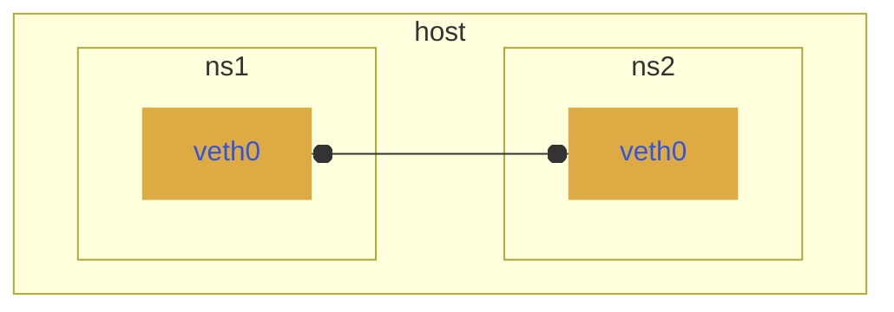

# netns-lab


ネームスペースでネットワーク検証

<p>動作確認 Ubuntu 24.04</p>
<p>RH系もおよそ動きそう</p>

**root権限必要です**
<br>

### 主要ツール

- iproute2
```sh
$ apt info iproute2
Package: iproute2
Version: 6.1.0-1ubuntu6
```

- iptables(nft)
```sh
$ apt info iptables
Package: iptables
Version: 1.8.10-3ubuntu2
```
<br>

### 最もシンプルなネットワーク
<br>

ネームスペース２つ作成
```sh
ip netns add ns1
ip netns add ns2
```


<br>

vethペア（仮想LANケーブル）でつなげる
```sh
ip link add veth0 netns ns1 type veth0 peer netns ns2
```


<br>

IPアドレスとリンクアップ
```sh
ip netns exec ns1 ip addr add 10.0.0.1/24 dev veth0
ip netns exec ns1 ip link set  veth0 up
ip netns exec ns2 ip addr add 10.0.0.2/24 dev veth0
ip netns exec ns2 ip link set  veth0 up
```


<br>

接続確認するコマンド例
```sh
ip netns exec ns1 ping -c 3 10.0.0.2
ip netns exec ns1 ip addr  # IPアドレス
ip netns exec ns1 ip link  # インターフェイス
ip netns exec ns1 ip nei   # 隣接するインターフェイス
ip netns exec ns1 ip route # ルーティングテーブル
```
<br>

ネームスペースを削除
```sh
ip netns delete ns1
ip netns delete ns2
ip --all netns delete
```

<br>

### Script

**vethペア接続**
- [namespace_ipv4.sh](https://github.com/tomato-tom/netns-lab/blob/main/script/namespace_ipv4.sh)
- [namespace_ipv6.sh](https://github.com/tomato-tom/netns-lab/blob/main/script/namespace_ipv6.sh)
- [host_namespace.sh](https://github.com/tomato-tom/netns-lab/blob/main/script/host_namespace.sh)
- [netns_docker.sh](https://github.com/tomato-tom/netns-lab/blob/main/script/netns_docker.sh)

**ブリッジ接続**
- [bridge.sh](https://github.com/tomato-tom/netns-lab/blob/main/script/bridge.sh)
- [vlan.sh](https://github.com/tomato-tom/netns-lab/blob/main/script/vlan.sh)

**ルーティング**
- [routing.sh](https://github.com/tomato-tom/netns-lab/blob/main/script/routing.sh)
- [line_topology.sh](https://github.com/tomato-tom/netns-lab/blob/main/script/line_topology.sh)
- [nat_masquerade.sh](https://github.com/tomato-tom/netns-lab/blob/main/script/nat_masquerade.sh)


**スクリプトの検索**
```sh
grep -ril vlan .
grep -ril -e router -e nat .
```

<br>

### nsfunc

一般ユーザで`script`ディレクトリにいる場合
```sh
sudo su
source nsfunc.sh

# ネームスペースのIPアドレス表示
nsinfo               # すべてのネームスペース
nsinfo ns1 ns5 rt3   # 引数でネームスペース指定

# ネームスペースと関連するブリッジ、ファイルを削除
rmns
```

もしくは`source $(pwd)/nsfunc.sh`を/root/.bashrc`等に追記すると便利かもしれません


### ホストArchlinux

Archlinuxでvethペア作成できない？<br>
デフォルトではモジュール読み込まれないみたい
```sh
# ip link add veth0 type veth peer name veth1
Error: Unknown device type.

# lsmod | grep veth
```

読み込みのファイル作成したらvethペアできた
```
# modprobe -c | grep veth
alias rtnl_link_veth veth

# echo "rtnl_link_veth" > /etc/modules-load.d/rtnl_link_veth.conf
```
[カーネルモジュール ArchWiki](
https://wiki.archlinux.jp/index.php/%E3%82%AB%E3%83%BC%E3%83%8D%E3%83%AB%E3%83%A2%E3%82%B8%E3%83%A5%E3%83%BC%E3%83%AB
)

bondingできない - Archlinux

<br>


### 今後追加してみたいスクリプト

- LXC/LXDとつなげる
- パケットフィルタリング iptables(nft)
- 帯域制限シミュレーション
- 動的ルーティング
- トンネリング
- IPV4/IPV6 over IPV4/IPV6
- DHCP DNS

本人よくわかってない、誰か追加してくれないかなあ...
<br>


### 参考資料

[Introduction to Linux interfaces for virtual networking](
https://developers.redhat.com/blog/2018/10/22/introduction-to-linux-interfaces-for-virtual-networking#
)
> iproute2の各種インターフェイス、bridge, vlan, vethなど図解とサンプル

<br>

[Network namespaceによるネットワークテスト環境の構築](
https://www.bit-hive.com/articles/20230315
)
> 基本的なネットワーク

<br>

[Network Namespace - CUBE SUGAR CONTAINER](
https://blog.amedama.jp/archive/category/Network%20Namespace#google_vignette
)
> 各種ルーティング、C言語でネームスペース作成とか

<br>

[ネットワーク勉強まとめ](
https://zenn.dev/bells17/scraps/ced3289cd8116d
)
> FRRoutingでOSPF

<br>

[Manpages of iproute2 in Debian unstable](
https://manpages.debian.org/unstable/iproute2/index.html
)

